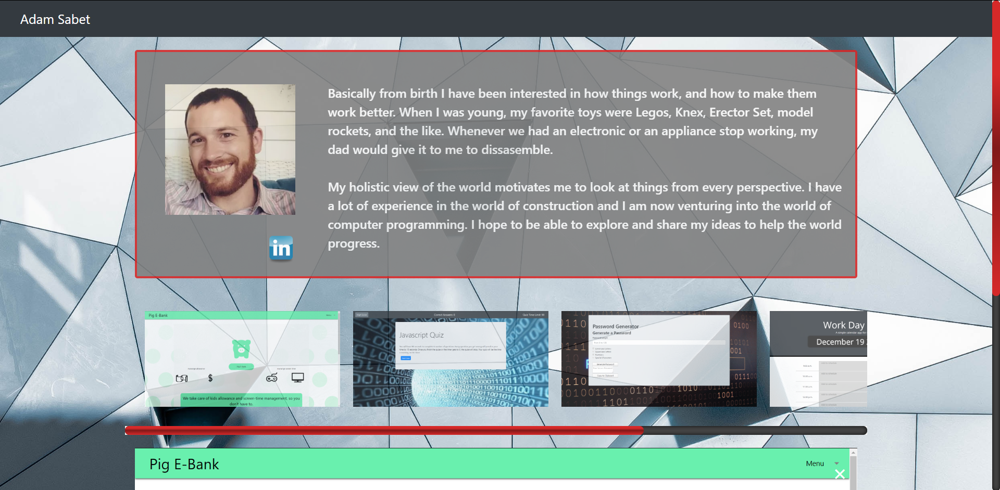

# Adam Sabet Portfolio

## Deployed link:
https://ajrsabet.github.io/Adam_Sabet_Portfolio/

 

## Method
In this itteration of my portfolio I wanted to create a simple one page design so that people can easily get to all of the information that they need with minimal navigation. 

## Components
- Simple card with profile pic and bio
- Linkedin icon to link for all communication and work history
- Tabbed project screenshot gallery with scrolling thumbnails which can be clicked for a larger view. Links are displayed on the larger view for both the project deployed URL and the GitHub repo page.

